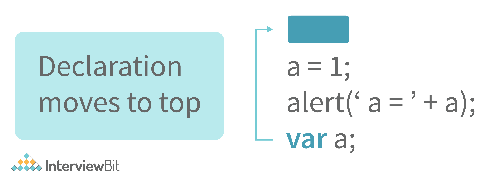
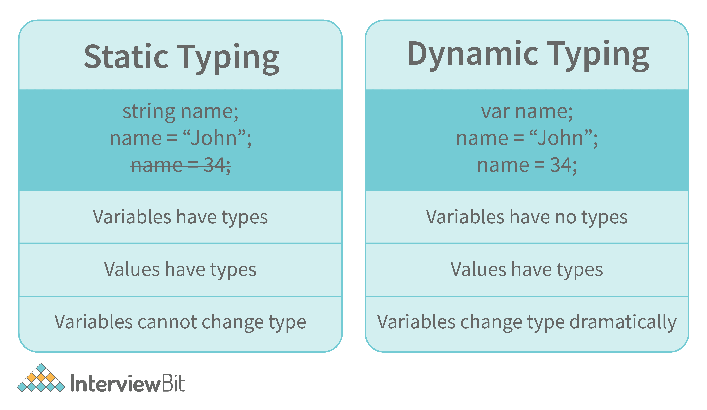
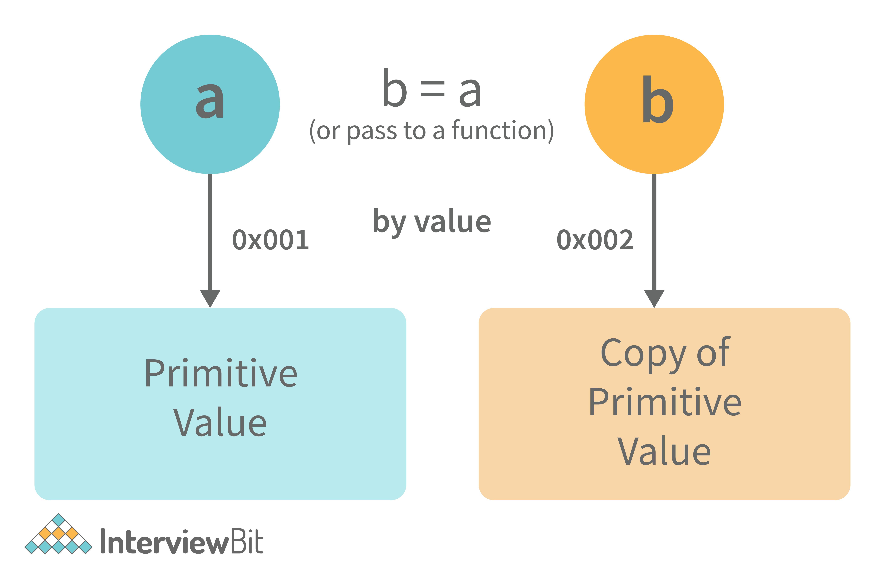
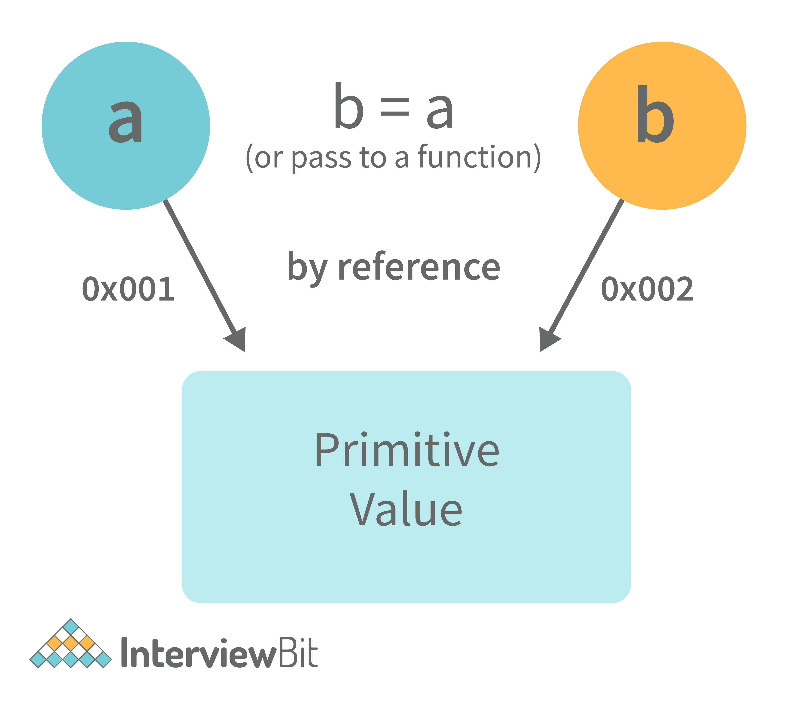

# 1. What are the different data types present in javascript?

To know the type of a JavaScript variable, we can use the typeof operator.

## 1. Primitive types

- String - It represents a series of characters and is written with quotes. A string can be represented using a single or a double quote.

Example :

    var str = "Vivek Singh Bisht"; //using double quotes
    var str2 = 'John Doe'; //using single quotes

- Number - It represents a number and can be written with or without decimals.

Example :

    var x = 3; //without decimal
    var y = 3.6; //with decimal

- BigInt - This data type is used to store numbers which are above the limitation of the Number data type. It can store large integers and is represented by adding “n” to an integer literal.

Example :

    var bigInteger =  234567890123456789012345678901234567890;

- Boolean - It represents a logical entity and can have only two values : true or false. Booleans are generally used for conditional testing.

Example :

    var a = 2;
    var b =  3;
    var c =  2;
    (a == b) // returns false
    (a == c) //returns true

- Undefined - When a variable is declared but not assigned, it has the value of undefined and it’s type is also undefined.

Example :

    var x; // value of x is undefined
    var y = undefined; // we can also set the value of a variable as undefined

- Null - It represents a non-existent or a invalid value.

Example :

    var z = null;

- Symbol - It is a new data type introduced in the ES6 version of javascript. It is used to store an anonymous and unique value.

Example :

    var symbol1 = Symbol('symbol');

- typeof of primitive types :

        typeof "John Doe" // Returns "string"
        typeof 3.14 // Returns "number"
        typeof true // Returns "boolean"
        typeof 234567890123456789012345678901234567890n // Returns bigint
        typeof undefined // Returns "undefined"
        typeof null // Returns "object" (kind of a bug in JavaScript)
        typeof Symbol('symbol') // Returns Symbol

## 2. Non-primitive types

- Primitive data types can store only a single value. To store multiple and complex values, non-primitive data types are used.

- Object - Used to store collection of data.

- Example:

        // Collection of data in key-value pairs

        var obj1 = {
        x:  43,
        y:  "Hello world!",
        z: function(){
            return this.x;
        }
        }
            
        // Collection of data as an ordered list
            
        var array1 = [5, "Hello", true, 4.1]; 

# 2. Explain Hoisting in javascript.

Hoisting is the default behaviour of javascript where all the variable and function declarations are moved on top.

This means that irrespective of where the variables and functions are declared, they are moved on top of the scope. The scope can be both local and global.

Example 1:

    hoistedVariable = 3;
    console.log(hoistedVariable); // outputs 3 even when the variable is declared after it is initialized
    var hoistedVariable;

Example 2:

    hoistedFunction();  // Outputs " Hello world! " even when the function is declared after calling

    function hoistedFunction(){ 
    console.log(" Hello world! ");
    } 

Example 3:

    // Hoisting takes place in the local scope as well
    function doSomething(){
    x = 33;
    console.log(x);
    var x;
    } 

doSomething(); // Outputs 33 since the local variable “x” is hoisted inside the local scope

Note - Variable initializations are not hoisted, only variable declarations are hoisted:

    var x;
    console.log(x); // Outputs "undefined" since the initialization of "x" is not hoisted
    x = 23;

Note - To avoid hoisting, you can run javascript in strict mode by using “use strict” on top of the code:

    "use strict";
    x = 23; // Gives an error since 'x' is not declared
    var x; 

# 3. Why do we use the word “debugger” in javascript?

The debugger for the browser must be activated in order to debug the code. Built-in debuggers may be switched on and off, requiring the user to report faults. The remaining section of the code should stop execution before moving on to the next line while debugging.

# 4. Difference between “ == “ and “ === “ operators.
Both are comparison operators. The difference between both the operators is that “==” is used to compare values whereas, “ === “ is used to compare both values and types.

Example:

    var x = 2;
    var y = "2";
    (x == y)  // Returns true since the value of both x and y is the same
    (x === y) // Returns false since the typeof x is "number" and typeof y is "string"
# 5. Difference between var and let keyword in javascript.

Some differences are 

1. From the very beginning, the 'var' keyword was used in JavaScript programming whereas the keyword 'let' was just added in 2015.

2. The keyword 'Var' has a function scope. Anywhere in the function, the variable specified using var is accessible but in ‘let’ the scope of a variable declared with the 'let' keyword is limited to the block in which it is declared. Let's start with a Block Scope.

3. In ECMAScript 2015, let and const are hoisted but not initialized. Referencing the variable in the block before the variable declaration results in a ReferenceError because the variable is in a "temporal dead zone" from the start of the block until the declaration is processed.

# 6. Explain Implicit Type Coercion in javascript.

Implicit type coercion in javascript is the automatic conversion of value from one data type to another. It takes place when the operands of an expression are of different data types.

- String coercion

String coercion takes place while using the ‘ + ‘ operator. When a number is added to a string, the number type is always converted to the string type.

Example 1:

    var x = 3;
    var y = "3";
    x + y // Returns "33" 

Example 2:

    var x = 24;
    var y = "Hello";
    x + y   // Returns "24Hello"; 

Note - ‘ + ‘ operator when used to add two numbers, outputs a number. The same ‘ + ‘ operator when used to add two strings, outputs the concatenated string:

    var name = "Vivek";
    var surname = " Bisht";
    name + surname     // Returns "Vivek Bisht" 

Let’s understand both the examples where we have added a number to a string,

When JavaScript sees that the operands of the expression x + y are of different types ( one being a number type and the other being a string type ), it converts the number type to the string type and then performs the operation. Since after conversion, both the variables are of string type, the ‘ + ‘ operator outputs the concatenated string “33” in the first example and “24Hello” in the second example.

Note - Type coercion also takes place when using the ‘ - ‘ operator, but the difference while using ‘ - ‘ operator is that, a string is converted to a number and then subtraction takes place.

    var x = 3;
    Var y = "3";
    x - y    //Returns 0 since the variable y (string type) is converted to a number type

- Boolean Coercion

Boolean coercion takes place when using logical operators, ternary operators, if statements, and loop checks. To understand boolean coercion in if statements and operators, we need to understand truthy and falsy values.

Truthy values are those which will be converted (coerced) to true. Falsy values are those which will be converted to false.

All values except false, 0, 0n, -0, “”, null, undefined, and NaN are truthy values.

If statements:

Example:

    var x = 0;
    var y = 23;
            
    if(x) { console.log(x) }   // The code inside this block will not run since the value of x is 0(Falsy)  
            
    if(y) { console.log(y) }    // The code inside this block will run since the value of y is 23 (Truthy)

- Logical operators: 

Logical operators in javascript, unlike operators in other programming languages, do not return true or false. They always return one of the operands.

OR ( | | ) operator - If the first value is truthy, then the first value is returned. Otherwise, always the second value gets returned.

AND ( && ) operator - If both the values are truthy, always the second value is returned. If the first value is falsy then the first value is returned or if the second value is falsy then the second value is returned.

Example:

    var x = 220;
    var y = "Hello";
    var z = undefined;
            
    x | | y    // Returns 220 since the first value is truthy
            
    x | | z   // Returns 220 since the first value is truthy
            
    x && y    // Returns "Hello" since both the values are truthy
            
    y && z   // Returns undefined since the second value is falsy
            
    if( x && y ){ 
    console.log("Code runs" ); // This block runs because x && y returns "Hello" (Truthy)
    }   
            
    if( x || z ){
    console.log("Code runs");  // This block runs because x || y returns 220(Truthy)
    }

- Equality Coercion

Equality coercion takes place when using ‘ == ‘ operator. As we have stated before

The ‘ == ‘ operator compares values and not types.

While the above statement is a simple way to explain == operator, it’s not completely true

The reality is that while using the ‘==’ operator, coercion takes place.

The ‘==’ operator, converts both the operands to the same type and then compares them.

Example:

    var a = 12;
    var b = "12";
    a == b // Returns true because both 'a' and 'b' are converted to the same type and then compared. Hence the operands are equal.

Coercion does not take place when using the ‘===’ operator. Both operands are not converted to the same type in the case of ‘===’ operator.

Example:

    var a = 226;
    var b = "226";

a === b // Returns false because coercion does not take place and the  operands are of different types. Hence they are not equal. 

# 7. Is javascript a statically typed or a dynamically typed language?

JavaScript is a dynamically typed language. In a dynamically typed language, the type of a variable is checked during run-time in contrast to a statically typed language, where the type of a variable is checked during compile-time.

Since javascript is a loosely(dynamically) typed language, variables in JS are not associated with any type. A variable can hold the value of any data type.

For example, a variable that is assigned a number type can be converted to a string type:

    var a = 23;
    var a = "Hello World!";

# 8. What is NaN property in JavaScript?

NaN property represents the “Not-a-Number” value. It indicates a value that is not a legal number.

typeof of NaN will return a Number.

To check if a value is NaN, we use the isNaN() function,

Note- isNaN() function converts the given value to a Number type, and then equates to NaN.

    isNaN("Hello")  // Returns true
    isNaN(345)   // Returns false
    isNaN('1')  // Returns false, since '1' is converted to Number type which results in 0 ( a number) 
    isNaN(true) // Returns false, since true converted to Number type results in 1 ( a number)
    isNaN(false) // Returns false
    isNaN(undefined) // Returns true

# 9. Explain passed by value 

In JavaScript, primitive data types are passed by value and non-primitive data types are passed by reference.

For understanding passed by value and passed by reference, we need to understand what happens when we create a variable and assign a value to it,

    var x = 2;

In the above example, we created a variable x and assigned it a value of “2”. In the background, the “=” (assign operator) allocates some space in the memory, stores the value “2” and returns the location of the allocated memory space. Therefore, the variable x in the above code points to the location of the memory space instead of pointing to the value 2 directly.

Assign operator behaves differently when dealing with primitive and non-primitive data types,

Assign operator dealing with primitive types:

    var y = 234;
    var z = y;

In the above example, the assign operator knows that the value assigned to y is a primitive type (number type in this case), so when the second line code executes, where the value of y is assigned to z, the assign operator takes the value of y (234) and allocates a new space in the memory and returns the address. Therefore, variable z is not pointing to the location of variable y, instead, it is pointing to a new location in the memory.

    var y = #8454; // y pointing to address of the value 234

    var z = y; 
        
    var z = #5411; // z pointing to a completely new address of the value 234
        
    // Changing the value of y
    y = 23;
    console.log(z);  // Returns 234, since z points to a new address in the memory so changes in y will not effect z

From the above example, we can see that primitive data types when passed to another variable, are passed by value. Instead of just assigning the same address to another variable, the value is passed and new space of memory is created.

Assign operator dealing with non-primitive types:

    var obj = { name: "Vivek", surname: "Bisht" };
    var obj2 = obj;

In the above example, the assign operator directly passes the location of the variable obj to the variable obj2. In other words, the reference of the variable obj is passed to the variable obj2.

    var obj = #8711;  // obj pointing to address of { name: "Vivek", surname: "Bisht" }
    var obj2 = obj;
    
    var obj2 = #8711; // obj2 pointing to the same address 

    // changing the value of obj1
            
    obj.name = "Akki";
    console.log(obj2);
        
    // Returns {name:"Akki", surname:"Bisht"} since both the variables are pointing to the same address.
From the above example, we can see that while passing non-primitive data types, the assigned operator directly passes the address (reference).

Therefore, non-primitive data types are always passed by reference.

# 10. What is an Immediately Invoked Function in JavaScript

An Immediately Invoked Function ( known as IIFE and pronounced as IIFY) is a function that runs as soon as it is defined.

Syntax of IIFE :

    (function(){ 
    // Do something;
    })();
    
To understand IIFE, we need to understand the two sets of parentheses that are added while creating an IIFE :

The first set of parenthesis:

    (function (){
    //Do something;
    })

While executing javascript code, whenever the compiler sees the word “function”, it assumes that we are declaring a function in the code. Therefore, if we do not use the first set of parentheses, the compiler throws an error because it thinks we are declaring a function, and by the syntax of declaring a function, a function should always have a name.

    function() {
    //Do something;
    }
    // Compiler gives an error since the syntax of declaring a function is wrong in the code above.

To remove this error, we add the first set of parenthesis that tells the compiler that the function is not a function declaration, instead, it’s a function expression.

The second set of parenthesis:

    (function (){
    //Do something;
    })();

From the definition of an IIFE, we know that our code should run as soon as it is defined. A function runs only when it is invoked. If we do not invoke the function, the function declaration is returned:

    (function (){
    // Do something;
    })

    // Returns the function declaration
Therefore to invoke the function, we use the second set of parenthesis.

# 11. What do you mean by strict mode in javascript and characteristics of javascript strict-mode?
In ECMAScript 5, a new feature called JavaScript Strict Mode allows you to write a code or a function in a "strict" operational environment. In most cases, this language is 'not particularly severe' when it comes to throwing errors. In 'Strict mode,' however, all forms of errors, including silent errors, will be thrown. As a result, debugging becomes a lot simpler.  Thus programmer's chances of making an error are lowered.

Characteristics of strict mode in javascript

Duplicate arguments are not allowed by developers.
In strict mode, you won't be able to use the JavaScript keyword as a parameter or function name.
The 'use strict' keyword is used to define strict mode at the start of the script. Strict mode is supported by all browsers.
Engineers will not be allowed to create global variables in 'Strict Mode.

# 12. Explain Higher Order Functions in javascript.

Functions that operate on other functions, either by taking them as arguments or by returning them, are called higher-order functions.

Higher-order functions are a result of functions being first-class citizens in javascript.

Examples of higher-order functions:

    function higherOrder(fn) {
    fn();
    }
    
    higherOrder(function() { console.log("Hello world") });  

    function higherOrder2() {
    return function() {
        return "Do something";
    }
    }      
    var x = higherOrder2();
    x()   // Returns "Do something"

# 13. Explain “this” keyword.
The “this” keyword refers to the object that the function is a property of.

The value of the “this” keyword will always depend on the object that is invoking the function.\

Confused? Let’s understand the above statements by examples:

    function doSomething() {
    console.log(this);
    }
    
    doSomething();
What do you think the output of the above code will be?

Note - Observe the line where we are invoking the function.

Check the definition again:

The “this” keyword refers to the object that the function is a property of.
In the above code, the function is a property of which object?

Since the function is invoked in the global context, the function is a property of the global object.

Therefore, the output of the above code will be the global object. Since we ran the above code inside the browser, the global object is the window object.

Example 2:

    var obj = {
        name:  "vivek",
        getName: function(){
        console.log(this.name);
    }
    }
    
    obj.getName();
In the above code, at the time of invocation, the getName function is a property of the object obj , therefore, this keyword will refer to the object obj, and hence the output will be “vivek”.

Example 3:

    var obj = {
        name:  "vivek",
        getName: function(){
        console.log(this.name);
    }
        
    }
        
    var getName = obj.getName;
        
    var obj2 = {name:"akshay", getName };
    obj2.getName();
Can you guess the output here?

The output will be “akshay”.

Although the getName function is declared inside the object obj, at the time of invocation, getName() is a property of obj2, therefore the “this” keyword will refer to obj2.

The silly way to understand the “this” keyword is, whenever the function is invoked, check the object before the dot. The value of this . keyword will always be the object before the dot.

If there is no object before the dot-like in example1, the value of this keyword will be the global object.

Example 4:

    var obj1 = {
        address : "Mumbai,India",
        getAddress: function(){
        console.log(this.address); 
    }
    }
    
    var getAddress = obj1.getAddress;
    var obj2 = {name:"akshay"};
    obj2.getAddress();    
Can you guess the output?

The output will be an error.

Although in the code above, this keyword refers to the object obj2, obj2 does not have the property “address”‘, hence the getAddress function throws an error.

# 14. What do you mean by Self Invoking Functions?

Without being requested, a self-invoking expression is automatically invoked (initiated). If a function expression is followed by (), it will execute automatically. A function declaration cannot be invoked by itself.

Normally, we declare a function and call it, however, anonymous functions may be used to run a function automatically when it is described and will not be called again. And there is no name for these kinds of functions.

# 15. Explain call(), apply() and, bind() methods.

1. call():

- It’s a predefined method in javascript.
- This method invokes a method (function) by specifying the owner object.
- Example 1:

        function sayHello(){
        return "Hello " + this.name;
        }
                
        var obj = {name: "Sandy"};
                
        sayHello.call(obj);
                
        // Returns "Hello Sandy"

- call() method allows an object to use the method (function) of another object.
- Example 2:

        var person = {
        age: 23,
        getAge: function(){
            return this.age;
        }
        }        
        var person2 = {age:  54};
        person.getAge.call(person2);      
        // Returns 54  

- call() accepts arguments:

        function saySomething(message){
        return this.name + " is " + message;
        }     
        var person4 = {name:  "John"};     
        saySomething.call(person4, "awesome");
        // Returns "John is awesome"    

apply()

The apply method is similar to the call() method. The only difference is that,

call() method takes arguments separately whereas, apply() method takes arguments as an array.

    function saySomething(message){
    return this.name + " is " + message;
    }        
    var person4 = {name:  "John"};
    saySomething.apply(person4, ["awesome"]);
2. bind():

- This method returns a new function, where the value of “this” keyword will be bound to the owner object, which is provided as a parameter.

- Example with arguments:

        var bikeDetails = {
            displayDetails: function(registrationNumber,brandName){
            return this.name+ " , "+ "bike details: "+ registrationNumber + " , " + brandName;
        }
        }
        
        var person1 = {name:  "Vivek"};
            
        var detailsOfPerson1 = bikeDetails.displayDetails.bind(person1, "TS0122", "Bullet");
            
        // Binds the displayDetails function to the person1 object
                
            
        detailsOfPerson1();
        //Returns Vivek, bike details: TS0122, Bullet

# 16. What is the difference between exec () and test () methods in javascript?

- test () and exec () are RegExp expression methods used in javascript. 
- We'll use exec () to search a string for a specific pattern, and if it finds it, it'll return the pattern directly; else, it'll return an 'empty' result.
- We will use a test () to find a string for a specific pattern. It will return the Boolean value 'true' on finding the given text otherwise, it will return 'false'.

# 17. What is currying in JavaScript?

Currying is an advanced technique to transform a function of arguments n, to n functions of one or fewer arguments.

Example of a curried function:

    function add (a) {
    return function(b){
        return a + b;
    }
    }

    add(3)(4) 
For Example, if we have a function f(a,b), then the function after currying, will be transformed to f(a)(b).

By using the currying technique, we do not change the functionality of a function, we just change the way it is invoked.

Let’s see currying in action:

    function multiply(a,b){
    return a*b;
    }

    function currying(fn){
    return function(a){
        return function(b){
        return fn(a,b);
        }
    }
    }

    var curriedMultiply = currying(multiply);

    multiply(4, 3); // Returns 12

    curriedMultiply(4)(3); // Also returns 12
As one can see in the code above, we have transformed the function multiply(a,b) to a function curriedMultiply , which takes in one parameter at a time.

# 18. What are some advantages of using External JavaScript?

External JavaScript is the JavaScript Code (script) written in a separate file with the extension.js, and then we link that file inside the <head> or <body> element of the HTML file where the code is to be placed. 

Some advantages of external javascript are

It allows web designers and developers to collaborate on HTML and javascript files.
We can reuse the code.
Code readability is simple in external javascript.

# 19. Explain Scope and Scope Chain in javas

Scope in JS determines the accessibility of variables and functions at various parts of one’s code.

In general terms, the scope will let us know at a given part of code, what are variables and functions we can or cannot access.

There are three types of scopes in JS:

Global Scope
Local or Function Scope
Block Scope
Global Scope: Variables or functions declared in the global namespace have global scope, which means all the variables and functions having global scope can be accessed from anywhere inside the code.

    var globalVariable = "Hello world";

    function sendMessage(){
    return globalVariable; // can access globalVariable since it's written in global space
    }
    function sendMessage2(){
    return sendMessage(); // Can access sendMessage function since it's written in global space
    }
    sendMessage2();  // Returns “Hello world”
Function Scope: Any variables or functions declared inside a function have local/function scope, which means that all the variables and functions declared inside a function, can be accessed from within the function and not outside of it.

    function awesomeFunction(){
    var a = 2;

    var multiplyBy2 = function(){
        console.log(a*2); // Can access variable "a" since a and multiplyBy2 both are written inside the same function
    }
    }
    console.log(a); // Throws reference error since a is written in local scope and cannot be accessed outside

    multiplyBy2(); // Throws reference error since multiplyBy2 is written in local scope
Block Scope: Block scope is related to the variables declared using let and const. Variables declared with var do not have block scope. Block scope tells us that any variable declared inside a block { }, can be accessed only inside that block and cannot be accessed outside of it.

    {
    let x = 45;
    }

    console.log(x); // Gives reference error since x cannot be accessed outside of the block

    for(let i=0; i<2; i++){
    // do something
    }

    console.log(i); // Gives reference error since i cannot be accessed outside of the for loop block
Scope Chain: JavaScript engine also uses Scope to find variables. Let’s understand that using an example:

    var y = 24;

    function favFunction(){
    var x = 667;
    var anotherFavFunction = function(){
        console.log(x); // Does not find x inside anotherFavFunction, so looks for variable inside favFunction, outputs 667
    }

    var yetAnotherFavFunction = function(){
        console.log(y); // Does not find y inside yetAnotherFavFunction, so looks for variable inside favFunction and does not find it, so looks for variable in global scope, finds it and outputs 24
    }

    anotherFavFunction();
    yetAnotherFavFunction();
    }
    favFunction();
As you can see in the code above, if the javascript engine does not find the variable in local scope, it tries to check for the variable in the outer scope. If the variable does not exist in the outer scope, it tries to find the variable in the global scope.

If the variable is not found in the global space as well, a reference error is thrown.

# 20. Explain Closures in JavaScript.

Closures are an ability of a function to remember the variables and functions that are declared in its outer scope.

    var Person = function(pName){
    var name = pName;

    this.getName = function(){
        return name;
    }
    }

    var person = new Person("Neelesh");
    console.log(person.getName());
Let’s understand closures by example:

    function randomFunc(){
    var obj1 = {name:"Vivian", age:45};

    return function(){
        console.log(obj1.name + " is "+ "awesome"); // Has access to obj1 even when the randomFunc function is executed

    }
    }

    var initialiseClosure = randomFunc(); // Returns a function

    initialiseClosure(); 
Let’s understand the code above,

The function randomFunc() gets executed and returns a function when we assign it to a variable:

    var initialiseClosure = randomFunc();
The returned function is then executed when we invoke initialiseClosure:

    initialiseClosure(); 
The line of code above outputs “Vivian is awesome” and this is possible because of closure.

    console.log(obj1.name + " is "+ "awesome");
When the function randomFunc() runs, it seems that the returning function is using the variable obj1 inside it:

Therefore randomFunc(), instead of destroying the value of obj1 after execution, saves the value in the memory for further reference. This is the reason why the returning function is able to use the variable declared in the outer scope even after the function is already executed.

This ability of a function to store a variable for further reference even after it is executed is called Closure.
